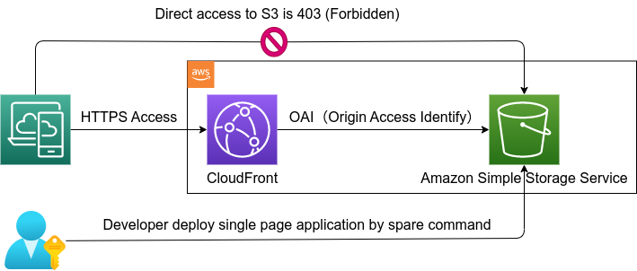

[](https://github.com/nao1215/spare/actions/workflows/linux_test.yml)
[](https://github.com/nao1215/spare/actions/workflows/mac_test.yml)
[](https://github.com/nao1215/spare/actions/workflows/windows_test.yml)
[](https://github.com/nao1215/spare/actions/workflows/reviewdog.yml)
[](https://github.com/nao1215/spare/actions/workflows/security.yml)

[](https://goreportcard.com/report/github.com/nao1215/spare)


> [!IMPORTANT]  
> I have archived the spare project and transferred its code to [nao1215/rainbow](https://github.com/nao1215/rainbow). If you want to check for updates, please refer to the rainbow project.

# spare - Single Page Application Release Easily
The 'spare' command makes easily the release of Single Page Applications. Spare constructs the infrastructure on AWS to operate the SPA, and then deploys the SPA (please note that it does not support building the SPA). Developers can inspect the infrastructure as CloudFormation before or after its construction.

The infrastructure for S3 and CloudFront is configured as shown in the diagram when you run the "spare build" command.  




When you run "spare deploy," it uploads the SPA (Single Page Application) from the specified directory to S3. The diagram below represents a sample SPA delivered by CloudFront. Please note that the "spare" command does not perform TypeScript compilation or any other build steps. It only handles the deployment of your files to S3.


## Support OS & golang version
- Linux
- MacOS
- Windows
- golang 1.20 or later


## How to install
### Use "go install"
If you does not have the golang development environment installed on your system, please install golang from [the golang official website](https://go.dev/doc/install).
```bash
go install github.com/nao1215/spare@latest
```
## How to use
### init subcommand
init subcommand create the configuration file .spare.yml in the current directory. If you want to change the configuration file name, please use the edit subcommand.

Below is the .spare.yml file created by the 'init' subcommand. As it's currently under development, the parameters will continue to change.
```.spare.yml
spareTemplateVersion: 0.0.1
deployTarget: src
region: us-east-1
customDomain: ""
s3BucketName: spare-us-east-1-ukdzd41mdfch7e6
allowOrigins: []
debugLocalstackEndpoint: http://localhost:4566
```

| Key                            | Default Value | Description                                                                                   |
|:--------------------------------|:---------------|:-----------------------------------------------------------------------------------------------|
| `spareTemplateVersion`          |   "0.0.1"             | The version of the Spare template. Unavailable.                                                            |
| `deployTarget`                 |    src           | The path of the deployment target (SPA).                                                      |
| `region`                       |   us-east-1| The AWS region.                                                                        |
| `customDomain`                 |     ""        | The domain name for CloudFront. If not specified, the CloudFront default domain name is used. Unavailable. |
| `s3BucketName`                 |  spare-{REGION}-{RANDOM_ID}             | The name of the S3 bucket.                                                                    |
| `allowOrigins`                 |     ""          | The list of domains allowed to access the SPA. Unavailable.                                                |
| `debugLocalstackEndpoint`      |  http://localhost:4566           | The endpoint for debugging Localstack.                                                         |*

### build subcommand
The 'build' subcommand constructs the AWS infrastructure. 

```bash
$ spare build --debug
2023/09/02 17:28:18 INFO [VALIDATE] check .spare.yml
2023/09/02 17:28:18 INFO [VALIDATE] ok .spare.yml
2023/09/02 17:28:18 INFO [CONFIRM ] check the settings

[debug mode]
 true
[aws profile]
 localstack
[.spare.yml]
 spareTemplateVersion: 0.0.1
 deployTarget: testdata
 region: ap-northeast-1
 customDomain:
 s3BucketName: spare-northeast-2q21wk200dunjsem
 allowOrigins:
 debugLocalstackEndpoint: http://localhost:4566

? want to build AWS infrastructure with the above settings? Yes                                       
2023/09/02 17:28:20 INFO [ CREATE ] start building AWS infrastructure
2023/09/02 17:28:20 INFO [ CREATE ] s3 bucket with public access block policy name=spare-northeast-2q21wk200dunjsem
2023/09/02 17:28:20 INFO [ CREATE ] cloudfront distribution
2023/09/02 17:28:20 INFO [ CREATE ] cloudfront distribution domain=localhost:4516
```

### deploy subcommand
The 'deploy' subcommand uploads the built artifacts to the S3 bucket.
```bash
$ spare deploy --debug
2023/09/02 17:29:01 INFO [  MODE  ] debug=true
2023/09/02 17:29:01 INFO [ CONFIG ] profile=localstack
2023/09/02 17:29:01 INFO [ DEPLOY ] target path=testdata bucket name=spare-northeast-2q21wk200dunjsem 
2023/09/02 17:29:01 INFO [ DEPLOY ] file name=images/why3.png
2023/09/02 17:29:01 INFO [ DEPLOY ] file name=why.html
2023/09/02 17:29:01 INFO [ DEPLOY ] file name=css/responsive.css
2023/09/02 17:29:01 INFO [ DEPLOY ] file name=about.html
2023/09/02 17:29:01 INFO [ DEPLOY ] file name=css/font-awesome.min.css
2023/09/02 17:29:01 INFO [ DEPLOY ] file name=contact.html
2023/09/02 17:29:01 INFO [ DEPLOY ] file name=js/custom.js
 :
 :
```

## How to develop
To develop the spare command, you will need an AWS account or the Pro version of localstack, which costs $35 USD per month as of September 2023.The configuration for localstack is specified in the compose.yml file. You can start localstack using the following command:

```bash
$ docker-compose up
```

If you choose to use localstack, please add the following information to your ~/.aws/config and ~/.aws/credentials files. The region can be set to any value you prefer.
```
$ cat ~/.aws/config 
[profile localstack]
region = ap-northeast-1
output = json

$ cat ~/.aws/credentials 
[localstack]
aws_access_key_id = dummy
aws_secret_access_key = dummy
```

The spare command uses the value of the AWS_PROFILE environment variable. If you are using localstack for debugging, you can set the AWS_PROFILE environment variable as follows:
```bash
export AWS_PROFILE=localstack
export LOCALSTACK_API_KEY=your_api_key
```

The spare command has a --debug option for its subcommands that access the infrastructure, and when --debug is enabled, it accesses localstack.

## Contributing
First off, thanks for taking the time to contribute! Contributions are not only related to development. For example, GitHub Star motivates me to develop!
<a href="https://star-history.com/#nao1215/spare&Date">
  <picture>
    <source media="(prefers-color-scheme: dark)" srcset="https://api.star-history.com/svg?repos=nao1215/spare&type=Date&theme=dark" />
    <source media="(prefers-color-scheme: light)" srcset="https://api.star-history.com/svg?repos=nao1215/spare&type=Date" />
    
  </picture>
</a>

## Contact
If you would like to send comments such as "find a bug" or "request for additional features" to the developer, please use one of the following contacts.
- [GitHub Issue](https://github.com/nao1215/spare/issues)

You can use the bug-report subcommand to send a bug report.
```bash
$ spare bug-report
※ Open GitHub issue page by your default browser
```

## License
The spare command is released under the MIT License, see [LICENSE](./LICENSE).
[testdata](https://www.free-css.com/free-css-templates/page270/xbee) is released under the [Creative Commons](https://www.free-css.com/help-and-support/copyright-notice#terms-of-use).

## Special Thanks

[LocalStack](https://localstack.cloud/) is a service that mocks AWS, covering a wide range of AWS services. It is not easy to set up an AWS infrastructure for personal development, but LocalStack has lowered the barrier for server application development.   

It has been incredibly helpful for my technical learning, and among the open-source software (OSS) I encountered in 2023, LocalStack is undoubtedly the best tool. I would like to take this opportunity to express my gratitude.
